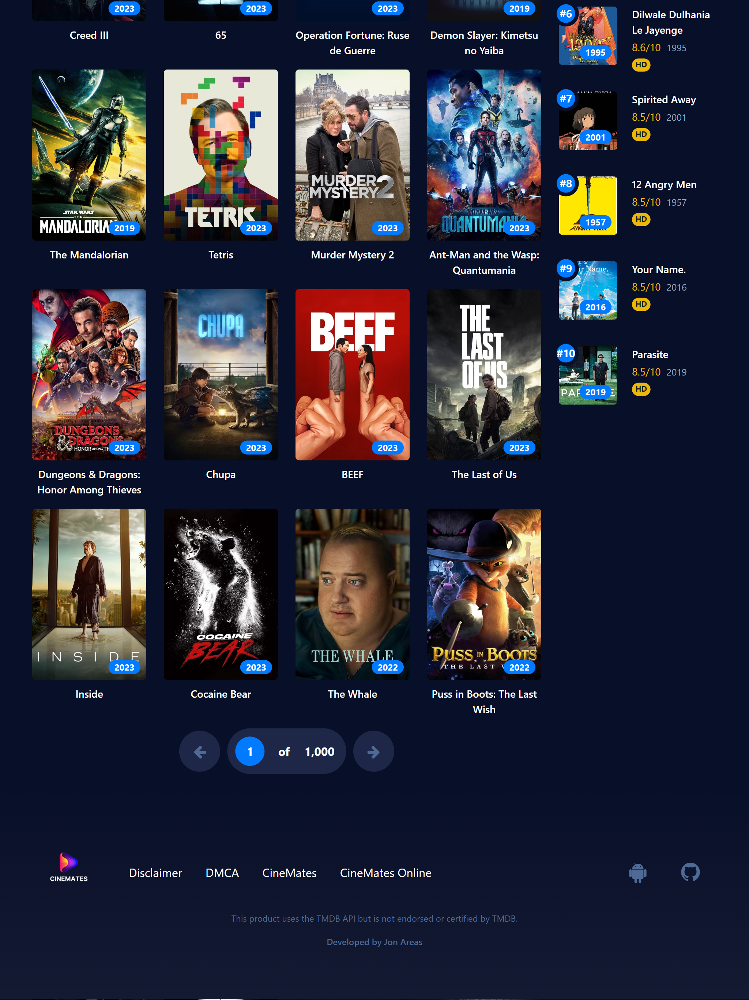

<a name="readme-top"></a>
<br />

<div align="center">
  <a href="#">
   <!-- Replace this logos for a custom official logos -->
    
  </a>

<h1 align = "center">
<b><i>CineMates</i></b>
</h1>
    <!-- Add/Remove categories depending on your project -->
  <p align="center">
    <a href="#-screenshots-">Screenshots</a>
    ·
    <a href="#-requirements-">Requirements</a>
    ·
    <a href="#-technologies-">Technologies</a>
    ·
    <a href="#-acknowledgements-">Acknowledgements</a>
    ·
    <a href="#-license-">License</a>
  </p>
</div>

<!-- Here goes the project description -->

**CineMates** is a website built using the Angular framework, that provides users with a comprehensive source of information on movies, TV shows, and actors. The website features a sleek and user-friendly interface that allows users to easily browse through their favorite movies, TV shows, or actors.

## 📷 Screenshots 📷


| Home Screen   | Home Screen  | 
| ------------- | ------------- |  
|   |   |

## 📝 Requirements 📝

This project uses [The Movie Database API](https://developers.themoviedb.org/3) to show data about movies, TV show/season, actors and their respective images.

1. Request an API key by creating an account and clicking the "API" link in the left hand side bar, at: https://www.themoviedb.org/
2. Clone this repository

```bash
git clone https://github.com/your_username_/Project-Name.git
```

3. Install npm packages

```bash
yarn install
```

Enter your API key in `environment.ts`

```javascript
export const environment = {
  production: true,
  apiKey: 'hereGoesYourApiKey',
  baseUrl: 'https://api.themoviedb.org/3',
};
```


## 🦾 Technologies 🦾

This Angular project relies on various libraries and frameworks to enable the development of dynamic and feature-rich web applications. Here's an overview of the key dependencies:

- **Angular**: A comprehensive and widely-used framework that empowers the creation of dynamic, high-performance web applications.

- **TypeScript**: A statically typed superset of JavaScript that compiles to plain JavaScript. It enhances the development experience by introducing static typing, improved tooling, and increased code reliability.

- **RxJs**: A reactive programming library that simplifies handling asynchronous and event-driven programming.

- **Bootstrap**: A popular CSS framework that provides a variety of pre-designed components and styles for building responsive and visually appealing web interfaces.

- **ESLint**: A pluggable static code analysis tool used to identify problematic code patterns and maintain code quality in JavaScript and TypeScript.

- **Husky**: A git hook management tool that facilitates the execution of scripts or commands before Git events like commit or push.

- **Prettier**: An opinionated code formatter that enforces consistent code style and formatting rules.

- **lint-staged**: A tool that enables running linters on staged files in a Git repository, working in conjunction with Husky to ensure code quality before committing.

- **animate.css**: A library for adding CSS animations to enhance user experience.

- **autoprefixer**: A tool that automatically adds vendor prefixes to CSS properties for cross-browser compatibility.

- **font-awesome**: A library providing a collection of scalable vector icons for web application design.

Please note that the specific versions of these dependencies may change over time, so it's essential to keep them up to date for optimal functionality and security.

<p align="right">(<a href="#readme-top">back to top</a>)</p>

## ⭐ Acknowledgements ⭐

The original project idea, as well as the logos are credited to [Antonio Di Nuzzo](https://github.com/indisparte), who designed CineMates as a [Mobile App for Android](https://github.com/indisparte/cinemates).

Additionally, the user interface is based off of [Cuevana](https://cuevana3.network/inicio): an Argentine file sharing website that offers movies and television content in their original languages with Spanish subtitles.

<p align="right">(<a href="#readme-top">back to top</a>)</p>

## 📜 License 📜

This project is under the [MIT License](./LICENSE).

```
MIT License

Copyright (c) 2023 Jonathan Areas

Permission is hereby granted, free of charge, to any person obtaining a copy
of this software and associated documentation files (the "Software"), to deal
in the Software without restriction, including without limitation the rights
to use, copy, modify, merge, publish, distribute, sublicense, and/or sell
copies of the Software, and to permit persons to whom the Software is
furnished to do so, subject to the following conditions:

The above copyright notice and this permission notice shall be included in all
copies or substantial portions of the Software.

THE SOFTWARE IS PROVIDED "AS IS", WITHOUT WARRANTY OF ANY KIND, EXPRESS OR
IMPLIED, INCLUDING BUT NOT LIMITED TO THE WARRANTIES OF MERCHANTABILITY,
FITNESS FOR A PARTICULAR PURPOSE AND NONINFRINGEMENT. IN NO EVENT SHALL THE
AUTHORS OR COPYRIGHT HOLDERS BE LIABLE FOR ANY CLAIM, DAMAGES OR OTHER
LIABILITY, WHETHER IN AN ACTION OF CONTRACT, TORT OR OTHERWISE, ARISING FROM,
OUT OF OR IN CONNECTION WITH THE SOFTWARE OR THE USE OR OTHER DEALINGS IN THE
SOFTWARE.
```

<p align="right">(<a href="#readme-top">back to top</a>)</p>

<!-- This is a custom version of the Read-My-README template, by Jon Areas,
found at: https://github.com/jxareas/read-my-readme -->
